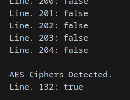

### Probelm

```plaintext
Detect AES in ECB mode
In this file are a bunch of hex-encoded ciphertexts.

One of them has been encrypted with ECB.

Detect it.

Remember that the problem with ECB is that it is stateless and deterministic; the same 16 byte plaintext block will always produce the same 16 byte ciphertext.
```

### Solution

-   Hex decode the file line by line
-   Write a function to detect if the ciphertext is encrypted with ECB
-   create a block size of 16 bytes for 128 bit AES
-   insert the block into slice and check if the block is already in the slice
-   If it does, it means that the same block has appeared before, which suggests that ECB mode might have been used. If a duplicate block is found, the function returns true, indicating that the input line is likely encrypted using ECB.

### Decoded



### Code

```go
package challenge8

import (
	"fmt"
	"os"
	"strings"

	c1 "cryptopals/Set1/challenge1"
)

func Challenge8() {
	file, err := os.ReadFile("./Set1/challenge8/8.txt")
	if err != nil {
		fmt.Printf("%s", err)
		return
	}
	lines := strings.Split(string(file), "\n")
	aess := make(map[int]bool)
	for i, line := range lines {
		bitByte := []byte(line)
		decoded := c1.DecodeHex(bitByte)
		status := IsAesEcb(decoded)
		fmt.Printf("Line. %d: %t\n", i, status)
		if status == true {
			aess[i] = status
		}
	}
	for i, v := range aess {
		fmt.Printf("\nAES Ciphers Detected. \nLine. %d: %t", i, v)
	}
}

func IsAesEcb(line []byte) bool {
	size := 16
	iteration := len(line) / size
	blocks := [][]byte{}
	for i := 0; i < iteration; i++ {
		start := i * size
		end := (i + 1) * size
		// block size increases by 16 everytime
		block := line[start:end]
		for _, v := range blocks {
			if BytesEqual(v, block) {
				return true
			}
		}
		blocks = append(blocks, block)
	}
	return false
}

func BytesEqual(s1, s2 []byte) bool {
	if len(s1) != len(s2) {
		return false
	}
	for i := 0; i < len(s1); i++ {
		if s1[i] != s2[i] {
			return false
		}
	}
	return true
}
```
