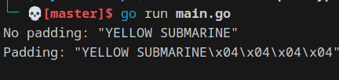

### Problem

```plaintext
Implement PKCS#7 padding
A block cipher transforms a fixed-sized block (usually 8 or 16 bytes) of plaintext into ciphertext. But we almost never want to transform a single block; we encrypt irregularly-sized messages.

One way we account for irregularly-sized messages is by padding, creating a plaintext that is an even multiple of the blocksize. The most popular padding scheme is called PKCS#7.

So: pad any block to a specific block length, by appending the number of bytes of padding to the end of the block. For instance,

"YELLOW SUBMARINE"
... padded to 20 bytes would be:

"YELLOW SUBMARINE\x04\x04\x04\x04"
```

### Solution

-   Write a function that takes a string and pads it to a given length with the number of bytes of padding to the end of the block.

### Decoded



### Code

```go
package challenge9

import "fmt"

func Challenge9() {
	input := []byte("YELLOW SUBMARINE")
	padded := PKCS(input, 20)
	fmt.Printf("No padding: %q\n", input)
	fmt.Printf("Padding: %q\n", padded)
}
func PKCS(input []byte, blockSize int) []byte {
	r := len(input) % blockSize
	pl := blockSize - r

	for i := 0; i < pl; i++ {
		input = append(input, byte(pl))
	}
	return input
}

func UnpadPKCS(a []byte) ([]byte, error) {
	if len(a) == 0 {
		panic("unpadding empty array")
	}
	last := int(a[len(a)-1])
	if last == 0 {
		return nil, fmt.Errorf("bad padding")
	}
	for i := 1; i < last; i++ {
		pos := len(a) - 1 - i
		if int(a[pos]) != last {
			return nil, fmt.Errorf("bad padding")
		}
	}
	return a[:len(a)-last], nil
}
```
