All the solved challenges from Talking web documented [here](https://axyut.notion.site/Talking-web-b2f52766b80c47b59712fc300979845a?pvs=4)

[CSE-365 2023] [https://pwn.college/cse365-f2023/talking-web](https://pwn.college/cse365-f2023/talking-web)

## Level 1

`Send an HTTP request using curl`

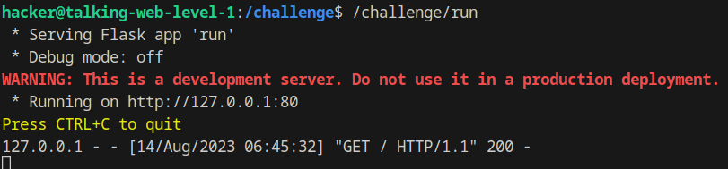

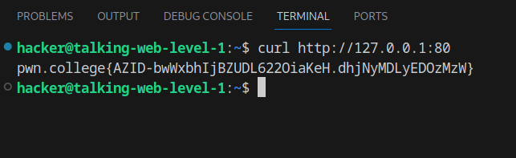

Flag: `AZID-bwWxbhIjBZUDL622OiaKeH.dhjNyMDLyEDOzMzW`

## Level 2

`Send an HTTP request using nc`

First start the server in `/challenge` then use `nc`

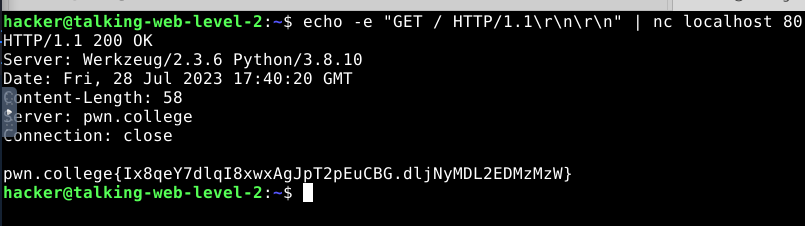

Flag: `pwn.college{sA08MVX6Vej3qREleqvYr9KIrXk.dljNyMDLyEDOzMzW}`

## Level 3

`Send an HTTP request using python`

We can create a new python file and write basic request to the localhost.

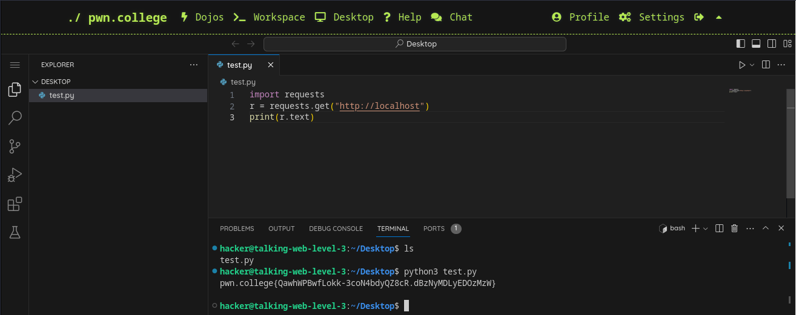

Flag: `pwn.college{QawhWPBwfLokk-3coN4bdyQZ8cR.dBzNyMDLyEDOzMzW}`

## Level 4

`Set the host header in an HTTP request using curl`
We’ll use flag `-H` to set the host header.

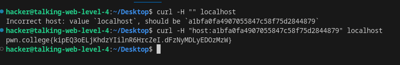

Flag: `pwn.college{kipEQ3oELjKhdzYIilnR6HrcZeI.dFzNyMDLyEDOzMzW}`

## Level 5

`Set the host header in an HTTP request using nc`

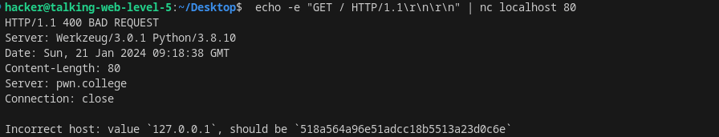

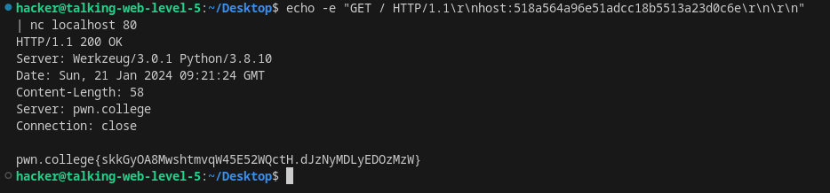

Flag: `pwn.college{QTIB8msWA3RCdQv0tFG6V38JiAK.dJzNyMDL2EDMzMzW}`

## Level 6

`Set the host header in an HTTP request using python`

We’ll copy the previous request and add the host, first we’ll get the host and then send it by attaching.

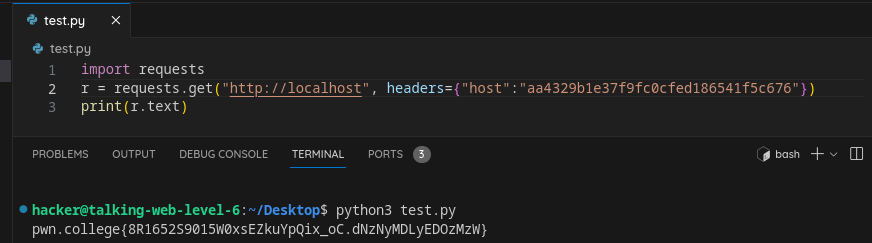

Flag: `8R1652S9015W0xsEZkuYpQix_oC.dNzNyMDLyEDOzMzW`

## Level 7

`Set the path in an HTTP request using curl`

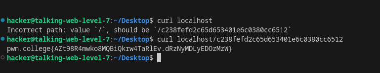

Flag: `AZt98R4mwko8MQBiQkrw4TaRlEv.dRzNyMDLyEDOzMzW`

## Level 8

`Set the path in an HTTP request using nc`
First we’ll send request at root then to the path.

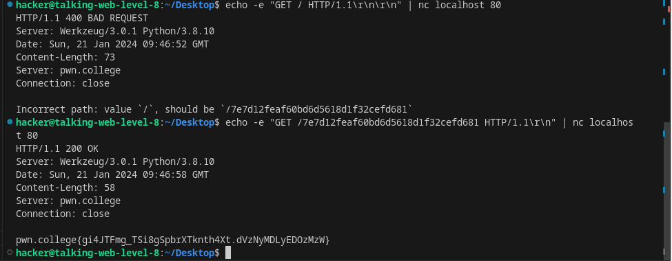

Flag: `gi4JTFmg_TSi8gSpbrXTknth4Xt.dVzNyMDLyEDOzMzW`

## Level 9

`Set the path in an HTTP request using python`

First send request to default route then add the path.

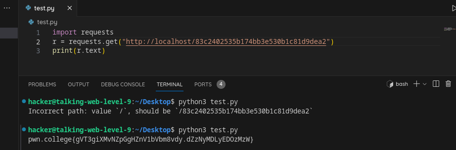

Flag: `gVT3giXMvNZpGgHZnV1bVbm8vdy.dZzNyMDLyEDOzMzW`

## Level 10

`URL encode a path in an HTTP request using curl`

We need to encode certain characters when writing it in a path, we’ll use `cyberChef` here to encode the path.

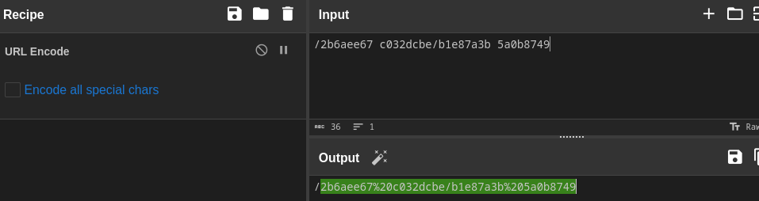

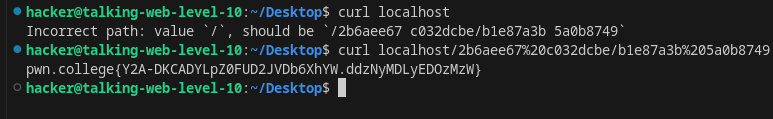

Flag: `Y2A-DKCADYLpZ0FUD2JVDb6XhYW.ddzNyMDLyEDOzMzW`

## Level 11

`URL encode a path in an HTTP request using nc`

Using `nc` with same approach. `echo -e "GET / HTTP/1.1\r\n\r\n" | nc localhost 80`

`echo -e "GET /05cb8cd0c481983a/729a7fd9471f6254 HTTP/1.1\r\n\r\n" | nc localhost 80`

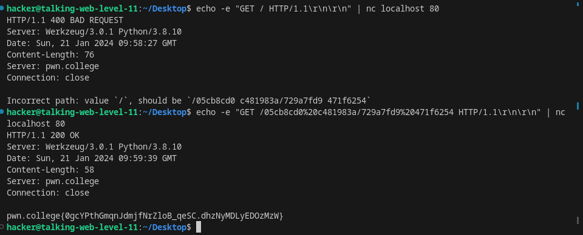

Flag: `0gcYPthGmqnJdmjfNrZloB_qeSC.dhzNyMDLyEDOzMzW`

## Level 12

`URL encode a path in an HTTP request using python`

Using python with same approach.

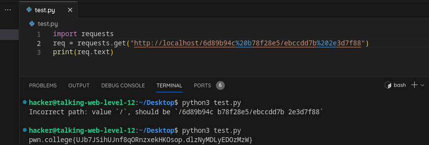

Flag: `UJb7JSihUJnf8qORnzxekHKOsop.dlzNyMDLyEDOzMzW`

## Level 13

`Specify an argument in an HTTP request using curl`

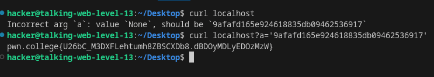

Flag: `U26bC_M3DXFLehtumh8ZBSCXDb8.dBDOyMDLyEDOzMzW`

## Level 14

`Specify an argument in an HTTP request using nc`

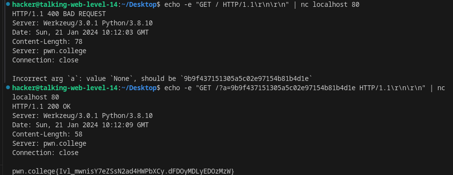

Flag: `Ivl_mwnisY7eZSsN2ad4HWPbXCy.dFDOyMDLyEDOzMzW`

## Level 15

`Specify an argument in an HTTP request using python`

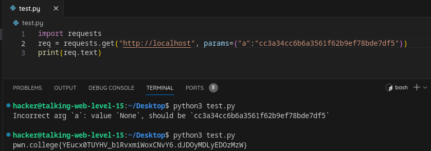

Flag: `YEucx0TUYHV_b1RvxmiWoxCNvY6.dJDOyMDLyEDOzMzW`

## Level 16

`Specify multiple arguments in an HTTP request using curl`

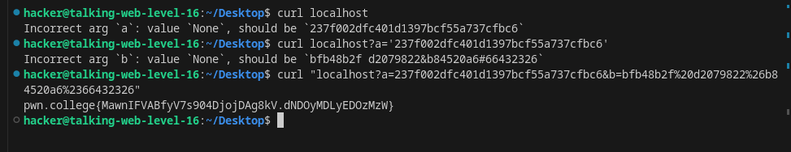

Flag: `MawnIFVABfyV7s904DjojDAg8kV.dNDOyMDLyEDOzMzW`

## Level 17

`Specify multiple arguments in an HTTP request using nc`

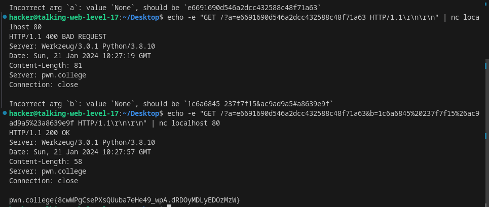

Flag: `8cwWPgCsePXsQUuba7eHe49_wpA.dRDOyMDLyEDOzMzW`

## Level 18

`Specify multiple arguments in an HTTP request using python`

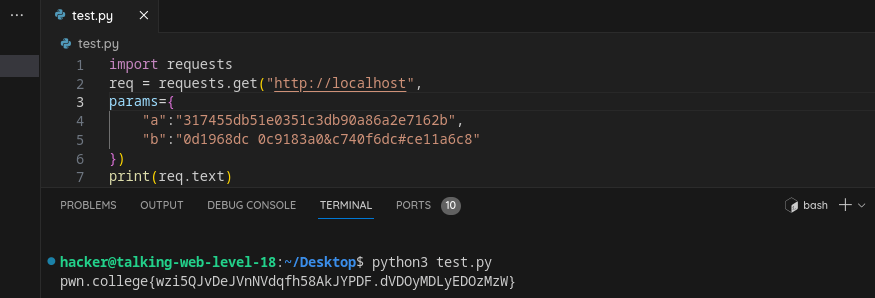

Flag: `wzi5QJvDeJVnNVdqfh58AkJYPDF.dVDOyMDLyEDOzMzW`

## Level 19

`Include form data in an HTTP request using curl`

We use `-X` flag for passing raw data and `-F` for form data.

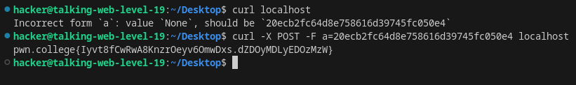

Flag: `Iyvt8fCwRwA8KnzrOeyv6OmwDxs.dZDOyMDLyEDOzMzW`

## Level 20

`Include form data in an HTTP request using nc`

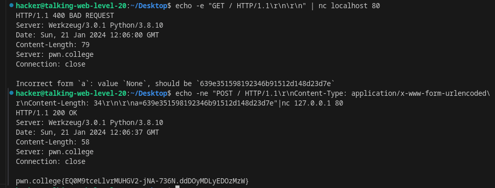

Flag: `EQ0M9tceLlvrMUHGV2-jNA-736N.ddDOyMDLyEDOzMzW`

## Level 21

`Include form data in an HTTP request using python`

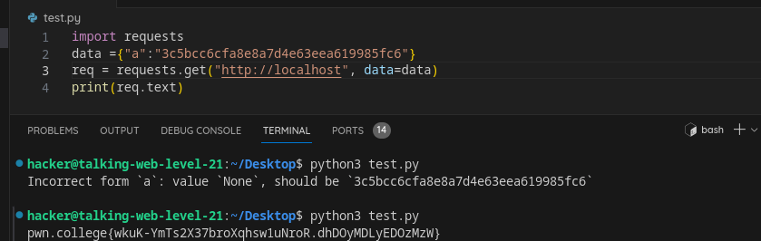

Flag: `wkuK-YmTs2X37broXqhsw1uNroR.dhDOyMDLyEDOzMzW`

## Level 22

`Include form data with multiple fields in an HTTP request using curl`

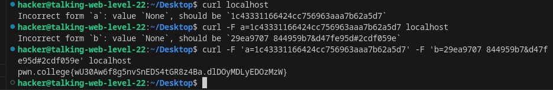

Flag: `wU30Aw6f8g5nvSnEDS4tGR8z4Ba.dlDOyMDLyEDOzMzW`

## Level 23

`Include form data with multiple fields in an HTTP request using nc`

```markdown
echo -ne "POST / HTTP/1.1\r\nContent-Type: application/x-www-form-urlencoded\r\nContent-Length: 1\r\n\r\na=a" | nc 127.0.0.1 80
a=55c4463abfea548138938c400f7235ec len 34 including a=
echo -ne "POST / HTTP/1.1\r\nContent-Type: application/x-www-form-urlencoded\r\nContent-Length: 34\r\n\r\na=55c4463abfea548138938c400f7235ec" | nc 127.0.0.1 80
b=0a26825a e57f8534&51c09c4a#822f1485 len 37  
&b=0a26825ae57f8534%2651c09c4a%23822f1485 len 44
echo -ne "POST / HTTP/1.1\r\nContent-Type: application/x-www-form-urlencoded\r\nContent-Length: 82\r\n\r\na=55c4463abfea548138938c400f7235ec&b=0a26825ae57f8534%2651c09c4a%23822f1485" | nc 127.0.0.1 80
```

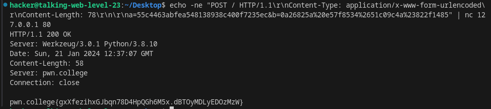

Flag: `gxXfezihxGJbqn78D4HpQGh6M5x.dBTOyMDLyEDOzMzW`

## Level 24

`Include form data with multiple fields in an HTTP request using python`

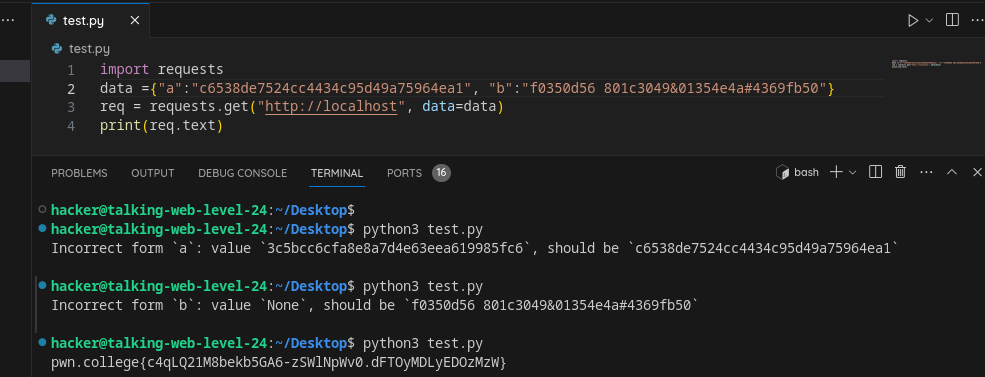

Flag : `c4qLQ21M8bekb5GA6-zSWlNpWv0.dFTOyMDLyEDOzMzW`

## Level 25

`Include json data in an HTTP request using curl`

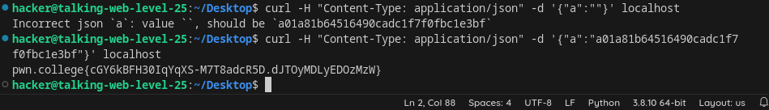

Flag: `cGY6kBFH30IqYqXS-M7T8adcR5D.dJTOyMDLyEDOzMzW`

## Level 26

`Include json data in an HTTP request using nc`

```markdown
echo -ne "POST / HTTP/1.1\r\nContent-Type: application/json\r\nContent-Length: 40\r\n\r\n{\"a\":\"25536e0031c5ca0d9752369af47cac90\"}" | nc 127.0.0.1 80
```

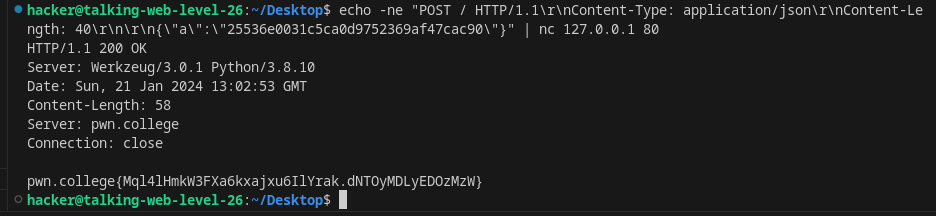

Fag : `Mql4lHmkW3FXa6kxajxu6IlYrak.dNTOyMDLyEDOzMzW`

## Level 27

`Include json data in an HTTP request using python`

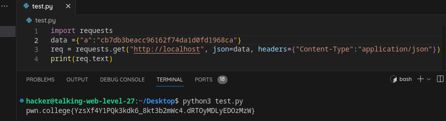

Flag: `YzsXf4Y1PQk3kdk6_8kt3b2mWc4.dRTOyMDLyEDOzMzW`

## Level 28

`Include complex json data in an HTTP request using curl`

```markdown
curl -H "Content-Type: application/json" -d '{"a":"674c8ad7c6c082bfc5d50ad8be0dec6c","b":{"c": "3207354e", "d": ["e73e0f7f", "d112a58e 5bf0cc8f&d9d7a0b7#509bebc3"]}}' localhost
```

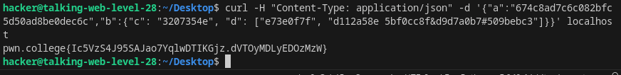

Flag: `Ic5VzS4J95SAJao7YqlwDTIKGjz.dVTOyMDLyEDOzMzW`

## Level 29

`Include complex json data in an HTTP request using nc`

```markdown
echo -ne "POST / HTTP/1.1\r\nContent-Type: application/json\r\nContent-Length:120\r\n\r\n{\"a\":\"2244302bb4bf4419083df0035a61b86c\",\"b\":{\"c\": \"663def73\", \"d\": [\"4310c430\", \"1bb2c230 f21460ee&420e776d#6b3e7bc7\"]}}"|nc 127.0.0.1 80
```

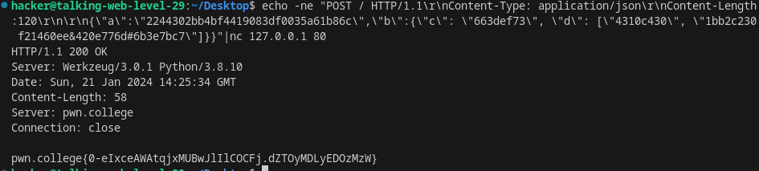

Flag: `0-eIxceAWAtqjxMUBwJlIlCOCFj.dZTOyMDLyEDOzMzW`

## Level 30

`Include complex json data in an HTTP request using python`

```markdown
import requests
data ={"a":"215c844d73deee014a6304368af80c26", "b":{
"c":"df8f9ee5",
"d":["1cf371d0", "af1cdfe7 6aa8f1cf&f7410053#8fc1d48a"]
}}
req = requests.get("http://localhost", json=data, headers={"Content-Type":"application/json"})
print(req.text)
```

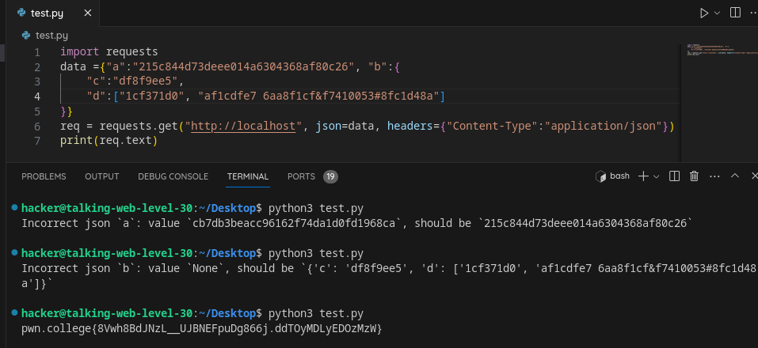

Flag : `8Vwh8BdJNzL__UJBNEFpuDg866j.ddTOyMDLyEDOzMzW`

## Level 31

`Follow an HTTP redirect from HTTP response using curl`

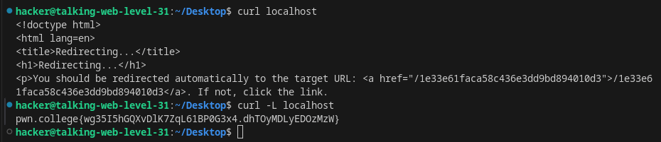

Flag: `wg35I5hGQXvDlK7ZqL61BP0G3x4.dhTOyMDLyEDOzMzW`

## Level 32

`Follow an HTTP redirect from HTTP response using nc`

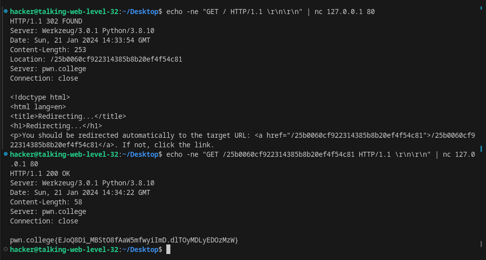

Flag: `EJoQ8Di_MBStO8fAaW5mfwyiImD.dlTOyMDLyEDOzMzW`

## Level 33

`Follow an HTTP redirect from HTTP response using python`

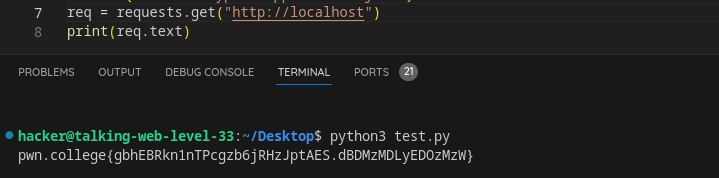

Flag: `gbhEBRkn1nTPcgzb6jRHzJptAES.dBDMzMDLyEDOzMzW`

## Level 34

`Include a cookie from HTTP response using curl`

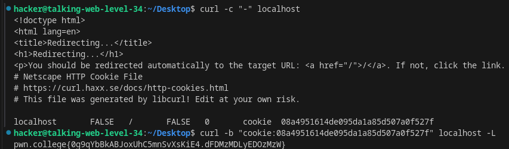

Flag: `0g9qYbBkABJoxUhC5mnSvXsKiE4.dFDMzMDLyEDOzMzW`

## Level 35

`Include a cookie from HTTP response using nc`

```markdown
echo -ne "GET / HTTP/1.1\r\n\r\n" | nc 127.0.0.1 80
echo -ne "GET / HTTP/1.1\r\nCookie: cookie=219a9d9f40719027d88698fc445778a5;\r\n\r\n" | nc 127.0.0.1 80
```

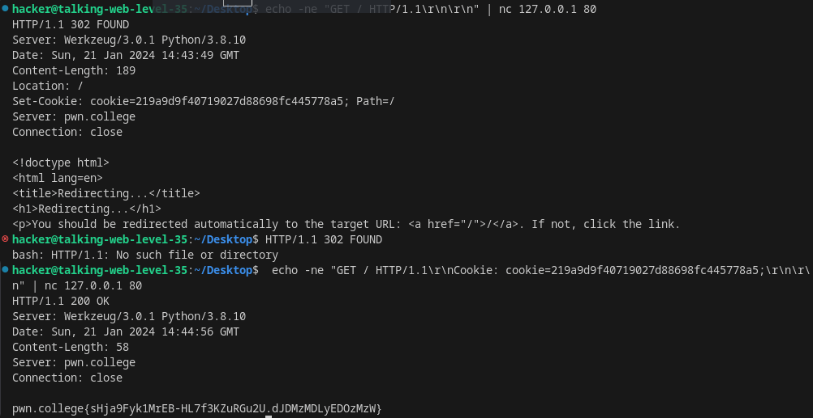

Flag: `sHja9Fyk1MrEB-HL7f3KZuRGu2U.dJDMzMDLyEDOzMzW`

## Level 36

`Include a cookie from HTTP response using python`

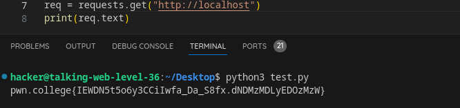

Flag: `IEWDN5t5o6y3CCiIwfa_Da_S8fx.dNDMzMDLyEDOzMzW`

## Level 37

`Make multiple requests in response to stateful HTTP responses using curl`

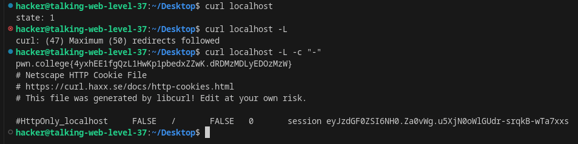

Flag: `4yxhEE1fgQzL1HwKp1pbedxZZwK.dRDMzMDLyEDOzMzW`

## Level 38

`Make multiple requests in response to stateful HTTP responses using nc`

```bash

hacker@talking-web-level-38:~/Desktop$ echo -ne "GET / HTTP/1.1\r\n\r\n" | nc 127.0.0.1 80
HTTP/1.1 302 FOUND
Server: Werkzeug/3.0.1 Python/3.8.10
Date: Sun, 21 Jan 2024 14:54:46 GMT
Content-Length: 9
Location: /
Server: pwn.college
Vary: Cookie
Set-Cookie: session=eyJzdGF0ZSI6MX0.Za0wNg.F_S_3DCkmlOGmX3WFPf0Rb5P0dM; HttpOnly; Path=/
Connection: close

state: 1
hacker@talking-web-level-38:~/Desktop$ echo -ne "Get / HTTP/1.1\r\nCookie: session=eyJzdGF0ZSI6MX0.Za0wNg.F_S_3DCkmlOGmX3WFPf0Rb5P0dM;\r\n\r\n" | nc 127.0.0.1 80
HTTP/1.1 302 FOUND
Server: Werkzeug/3.0.1 Python/3.8.10
Date: Sun, 21 Jan 2024 14:55:43 GMT
Content-Length: 9
Location: /
Server: pwn.college
Vary: Cookie
Set-Cookie: session=eyJzdGF0ZSI6Mn0.Za0wbw._Kss_t4wl0oMMQbmdgsfFJeXmmw; HttpOnly; Path=/
Connection: close

state: 2
hacker@talking-web-level-38:~/Desktop$ echo -ne "Get / HTTP/1.1\r\nCookie: session=eyJzdGF0ZSI6Mn0.Za0wbw._Kss_t4wl0oMMQbmdgsfFJeXmmw;\r\n\r\n" | nc 127.0.0.1 80
HTTP/1.1 302 FOUND
Server: Werkzeug/3.0.1 Python/3.8.10
Date: Sun, 21 Jan 2024 14:56:11 GMT
Content-Length: 9
Location: /
Server: pwn.college
Vary: Cookie
Set-Cookie: session=eyJzdGF0ZSI6M30.Za0wiw.6ATlHCtE8DHUL_rGW-EPYu7HwbQ; HttpOnly; Path=/
Connection: close

state: 3
hacker@talking-web-level-38:~/Desktop$ echo -ne "Get / HTTP/1.1\r\nCookie: session=eyJzdGF0ZSI6M30.Za0wiw.6ATlHCtE8DHUL_rGW-EPYu7HwbQ;\r\n\r\n" | nc 127.0.0.1 80
HTTP/1.1 200 OK
Server: Werkzeug/3.0.1 Python/3.8.10
Date: Sun, 21 Jan 2024 14:56:37 GMT
Content-Length: 58
Server: pwn.college
Vary: Cookie
Set-Cookie: session=eyJzdGF0ZSI6NH0.Za0wpQ.s34ZkEKKBCZf0otLdhm57z7Sb7k; HttpOnly; Path=/
Connection: close

pwn.college{o8hvXjgMnz0UkjnVO2LB4CkZXEW.dVDMzMDLyEDOzMzW}
```

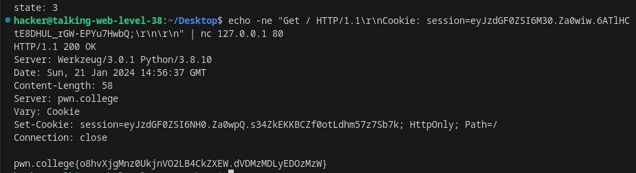

Flag: `pwn.college{o8hvXjgMnz0UkjnVO2LB4CkZXEW.dVDMzMDLyEDOzMzW}`

## Level 39

`Make multiple requests in response to stateful HTTP responses using python`

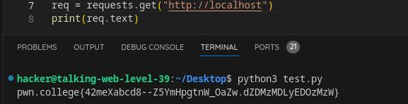

Flag: `42meXabcd8--Z5YmHpgtnW_OaZw.dZDMzMDLyEDOzMzW`
