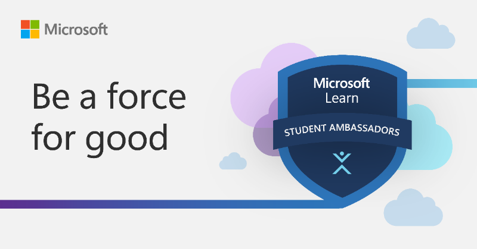
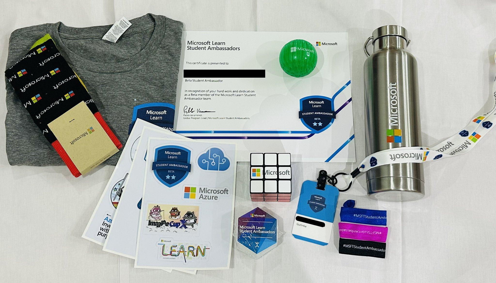

### Microsoft Learn Student Ambassador Program 2024 [Updated August]

The Microsoft Learn Student Ambassador Program is a global group of on-campus ambassadors who are eager to help fellow students, create robust tech communities, and develop technical and career skills for the future. MLSAs are passionate about technology and are always looking to grow, learn, and connect with other students. They are also eager to share their knowledge and experiences with others.

### What do MLSAs do?

MLSAs are responsible for organizing tech events, workshops, and hackathons on campus. They also help students learn about Microsoft technologies and products, and they provide feedback to Microsoft about their experiences. MLSAs are also responsible for creating and sharing technical content, such as blog posts, videos, and tutorials, to help other students learn and grow.

### Benefits of being an MLSA

1. Access to Microsoft technologies and products.
1. Training and support from Microsoft.
1. Opportunities to attend and speak at tech events and conferences.

## How to become an MLSA

To become an MLSA, you must be a student at a recognized educational institution and have a passion for technology. You must also be willing to commit to the program and actively participate in its activities. To apply, you must complete an online application, before 2024 you also had to submit video response. If you are selected, you will be invited to join the program and become an MLSA.

### As of 2024 August,

First round of applications are nothing but your basic information. You can apply [here](https://mvp.microsoft.com/studentambassadors). After successful submission, you will be invited to complete the second round of application from email providing you a link to official Discord server of MLSA program. You'll also receive your contributor id in 3-5 days of time through email, more about it later. After joining discord server, link you github from server's down arrow settings button, click on `Link github` and connect your github account. Second round is completing technical training provided by microsoft, click on `ambassador-faq` channel and follow the instructions.

### Technical Training

One thing to note is that there are quarterly training sessions, so you can apply anytime and complete training as well as other paths requirement but you'll only be officially onboarded as MLSA in the next quarter.
`Q1 plan starts January 1 and ends March 31`
`Q2 plan starts April 1 and ends June 30`
`Q3 plan starts July 1 and ends September 30`
`Q4 plan starts October 1 and ends December 31`

### Paths:

After completing the training, you'll have to choose one of the three paths: `Community Builder`, `Community Influencer`, `Startup Advocate`. These three paths are equally challenging so there's no easy way out. To complete each tasks you'll need your contributor id, which you'll receive in 3-5 days of time via email, after submitting your first round of application. In each path you're required to copy links and share it, where contributor id comes in, you'll have to append it to the link you're sharing. For example, if you're sharing a learn module link, you'll have to append `?wt.mc_id=studentamb_id` at the end of the link, `https://learn.microsoft.com/en-us/training/courses/ai-900t00?wt.mc_id=studentamb_######`

### Community Builder

Community Builder path is for those who are interested in organizing events, workshops, and hackathons on campus, because you're going to build your own course and share it with other people to participate in. As Microsoft says, `host Student Learn Plans with their Contributor IDs to reach 1,000 net-new modules completed by plan participants`, it means the learn-plans/course you created in `learn.microsoft.com` should have collectively 1000 completion of modules from your viewer/community/students. You can create multiple courses and they each can have different number of modules, when your viewer completes any one of you module, it counts as 1. So, for this you need the help of your community and build them by sharing valuable content. Before 2024, this path required 1500+ completions.

### Community Influencer

As a community influencer you'll be responsible for promoting microsoft services and resources to your community, you'll have to share links to microsoft blogs, learn modules, and other resources to your community. Before the 3rd quarter of 2024, this path was handled a bit differently. You would have to reach 2000 unique visitors on your shared links, and you can share multiple links, so you can share multiple links and reach 2000 count. As of now, it's not clear how this path is going to be handled, as microsoft are using propreitary tool/metric called Preferred visitors but it's going to be similar to the previous one.

### Preferred Visitors

As microsoft says, `Preferred Visitors are a proprietary metric, and the specific dimensions cannot be disclosed. When sharing content, focus on the larger purpose of the path - attract audience, drive engagement and build relationships - to see your count rise.` we can deduct that it requires unique visitors as well as their engagement on the shared links. So, you'll have to share links and make sure people are interacting with it, and you'll have to reach 250 count of preferred visitors, `share content with their Contributor IDs to reach 250 Preferred Visitors to eligible Microsoft URLs`. You will receive you total count on late Sunday evening on weekly basis from microsoft, so analyze you count and adapt your sharing strategy accordingly.

### Startup Advocate

Before 3rd quarter of 2024, this path required 30 applications to be submitted to Microsoft for startups, but now it's changed to 15 applications. You'll have to find and help startups to get into Microsoft for Startups Founders Hub, and you'll have to be the referer while submitting applications, otherwise, it won't count, as said by Microsoft `Instruct your referrals to include your full Contributor ID in the Affiliations section of the application under the field List any other partners affiliated with your business concept`.

### Valid sub-domains for `studentamb_id`:

-   [Azure.Microsoft.com](https://azure.microsoft.com?wt.mc_id=studentamb_363474)
-   [Code.Visualstudio.com](https://code.visualstudio.com?wt.mc_id=studentamb_363474)
-   [Devblogs.Microsoft.com](https://devblogs.microsoft.com?wt.mc_id=studentamb_363474)
-   [Developer.Microsoft.com](https://developer.microsoft.com?wt.mc_id=studentamb_363474)
-   [Dotnet.Microsoft.com](https://dotnet.microsoft.com?wt.mc_id=studentamb_363474)
-   [ImagineCup.Microsoft.com](https://imaginecup.microsoft.com?wt.mc_id=studentamb_363474)
-   [Learn.Microsoft.com](https://learn.microsoft.com?wt.mc_id=studentamb_363474)
-   [Microsoft.com/Microsoft-Cloud/Blog](https://microsoft.com/microsoft-cloud/blog?wt.mc_id=studentamb_363474)
-   [Microsoft.com/Startups](https://microsoft.com/startups?wt.mc_id=studentamb_363474)
-   [MVP.Microsoft.com](https://mvp.microsoft.com?wt.mc_id=studentamb_363474)
-   [Techcommunity.Microsoft.com](https://techcommunity.microsoft.com?wt.mc_id=studentamb_363474)

Visit these links and you'll see the `studentamb_id` appended at the end of the URL, it will also help me increase my chances of getting selected as MLSA. Thank you, but if you want to add your own `studentamb_id` in these links, contact me on [mail](mailto:mail@axyut.me) or [discord](https://discord.gg/axyut) and I'll add more down below so that everyone who sees it can help each other by clicking it(also, just clicking will not help in either of paths as of now, so interact here and there in website).
