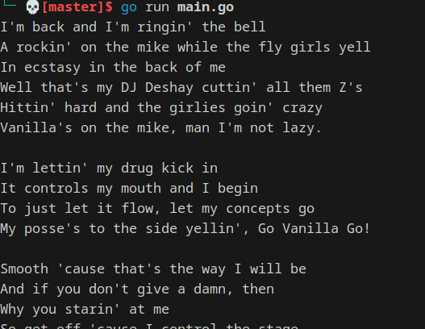

# Problem

```plaintext
AES in ECB mode
The Base64-encoded content in this file has been encrypted via AES-128 in ECB mode under the key

"YELLOW SUBMARINE".
(case-sensitive, without the quotes; exactly 16 characters; I like "YELLOW SUBMARINE" because it's exactly 16 bytes long, and now you do too).

Decrypt it. You know the key, after all.

Easiest way: use OpenSSL::Cipher and give it AES-128-ECB as the cipher.
```

# Solution

- Decode the base64 encoded string from the file
- Use the key "YELLOW SUBMARINE" to decrypt the string
- Write function to decrypt AES-128-ECB using key and ciphertext and return plaintext


We can see the text file cipher and the key given to us in the problem are correct and our code is correct because the output is the same as the output from the cyberchef recipe.

# Decoded


