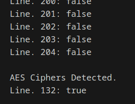

# Probelm

```plaintext
Detect AES in ECB mode
In this file are a bunch of hex-encoded ciphertexts.

One of them has been encrypted with ECB.

Detect it.

Remember that the problem with ECB is that it is stateless and deterministic; the same 16 byte plaintext block will always produce the same 16 byte ciphertext.
```

# Solution

- Hex decode the file line by line
- Write a function to detect if the ciphertext is encrypted with ECB
- create a block size of 16 bytes for 128 bit AES
- insert the block into slice and check if the block is already in the slice
- If it does, it means that the same block has appeared before, which suggests that ECB mode might have been used. If a duplicate block is found, the function returns true, indicating that the input line is likely encrypted using ECB.

# Decoded


