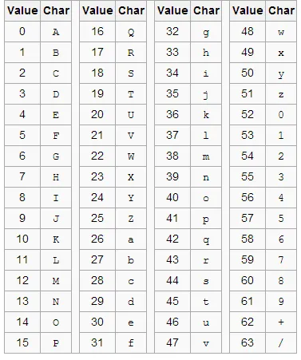

# Problem

Convert hex to base64

The string:
49276d206b696c6c696e6720796f757220627261696e206c696b65206120706f69736f6e6f7573206d757368726f6f6d

Should produce:
SSdtIGtpbGxpbmcgeW91ciBicmFpbiBsaWtlIGEgcG9pc29ub3VzIG11c2hyb29t

# Solution

## Strategy

- Convert hex to binary

## Explanation

First decoding our input hex encoded string to binary. To hex encode a string we break each byte of string into two 4 bits and then convert each 4 bits to hex. For example, `Hello` is encoded as `48656c6c6f` in hex. The first byte `72` translate to `01001000` in binary splitting 4 bits at a time we get `0100 1000` which is `48` in hex.

```go
hello := "Hello"
fmt.Println([]byte(hello))  //[72 101 108 108 111]
```

We have `49276d206b696c6c696e6720796f757220627261696e206c696b65206120706f69736f6e6f7573206d757368726f6f6d`, first two characters 49 translates to `01001001` in binary, `73` in decimal and `I` in ASCII.

Now that we have decoded from hex encoding, we need to encode it to base64.

- We break it down into bytes and take 3 bytes of binary data and split it into 4 groups of 6 bits each.
- Each group of 6 bits is then converted to a character in the base64 alphabet.
- If the last bits come short of bits we pad it with `=`.

For example, `I'm` is represented by the bytes `73 39 109`, which in binary is `01001001 00100111 01101101`. Splitting this into groups of 6 bits gives `010010 010010 011101 101101` which translates to `S S d t` in base64.



### Decoded


