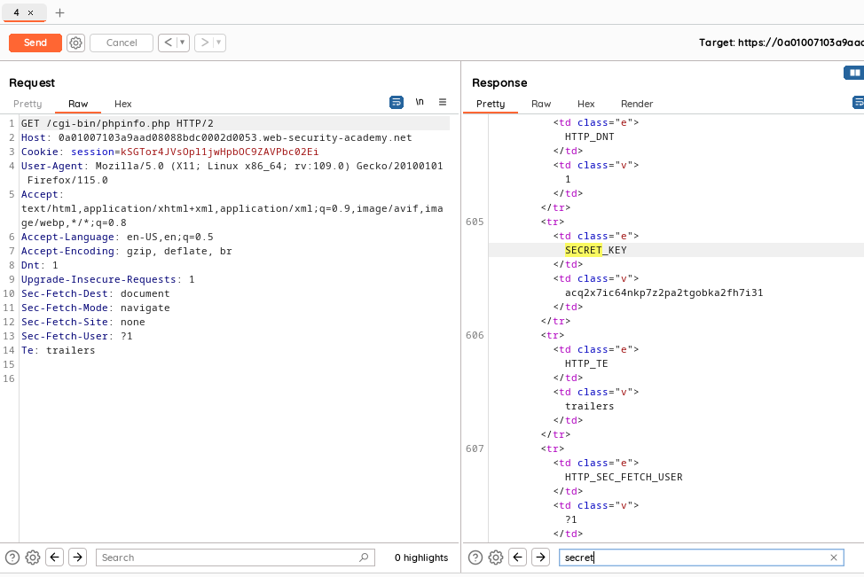
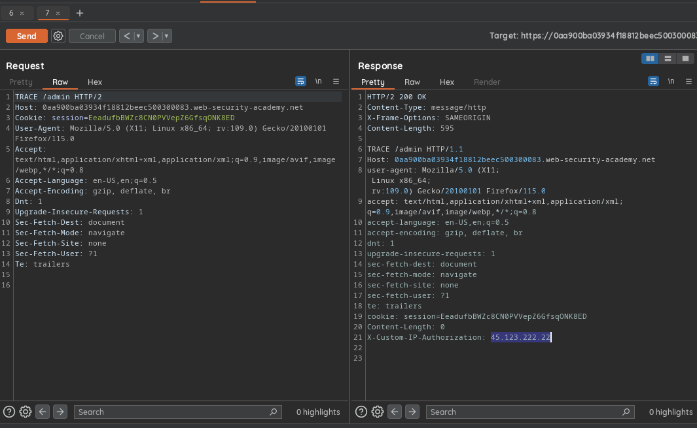

# Information Disclosure

## Lab 1 -> Information Disclosure in Error Messages
When we try to get the error by sending random string in the product id params, we get error from the server where there is version number for the java framework at the bottom, that is the flag.

## Lab 2 -> Information Disclosure on Debug Page
There's a secret debug page/file hosted which reveals some secret about the server, the endpoint was commented at the root page of the website, upon visiting `/cgi-bin/phpinfo.php` we are provided with secret key.

## Lab 3 -> Source Code Disclosure via Backup Files
According to challenge we need to get the database password which apparently has been leaked via backup source code, to find the endpoint first we travel `/robots.txt` which gives us the actual path `/backup` which we could have guessed as well, then we get the actual file path and see the source code and analyze the password of the db after looking at the code.

## Lab 4 -> Authentication bypass via Information Disclosure
To solve the lab we need to delete user carlos by accessing `/admin` panel, upon visiting we see we cannot because we are not admin, then we use `TRACE` method to check what user info is being sent, we see our ip was sent and the server was authorizing based on the ip, so we add new value of `X-Custom-Ip-Authorization: 127.0.0.1` to our request and we get access to the admin panel, then we can delete the user and lab is solved.

## Lab 5 -> Information Disclosure in Version Control History
According the description there is a git version issue, so we try endpoints such as /v1 /v0 etc but it was `/.git` to access the file we `wget -r <path>` and download the git folder, upon local inspection there was change in config file so we diff the files data and we get the password, then we can go back and login as administrator and delete the user carlos.

